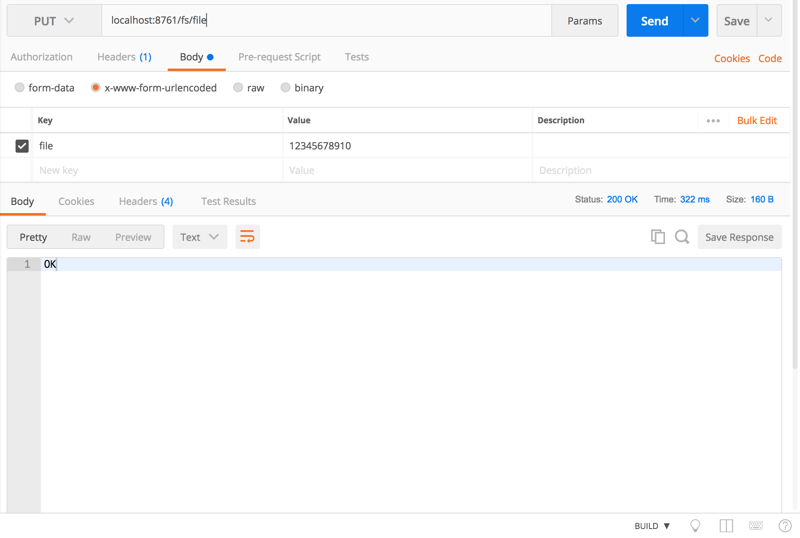
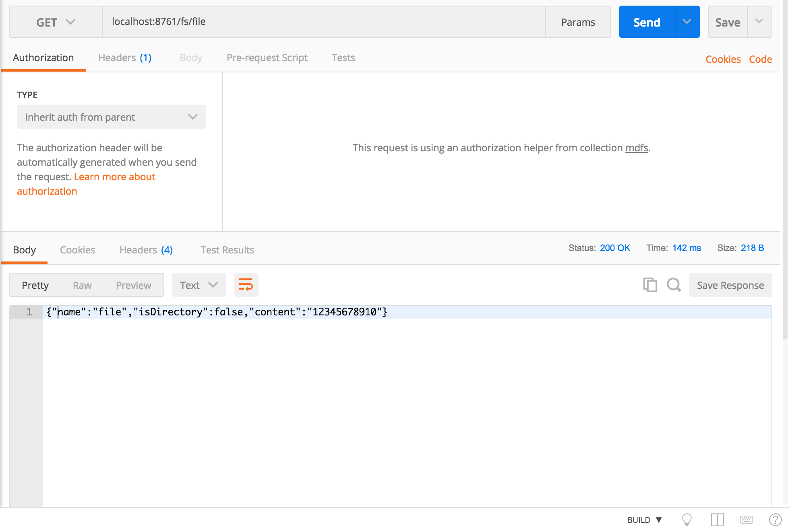
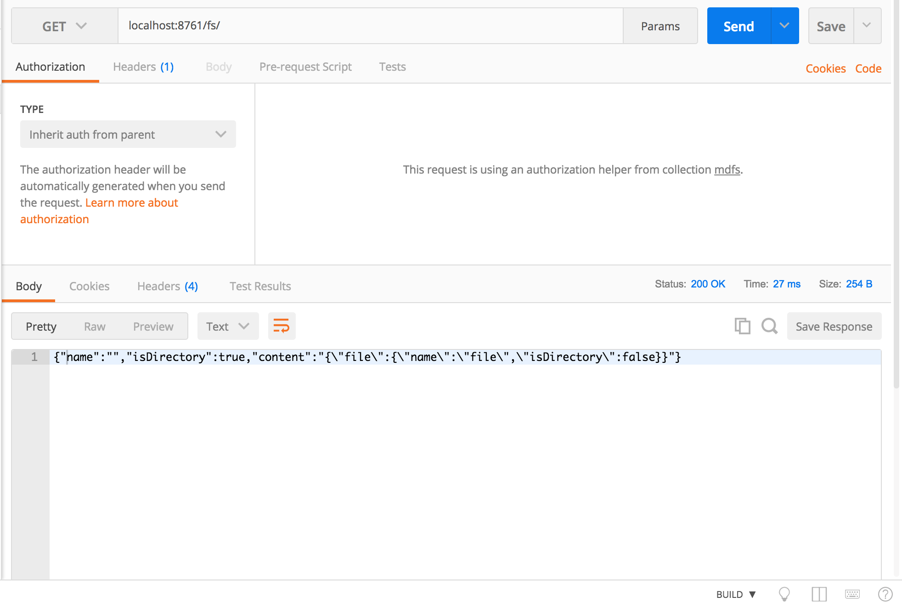
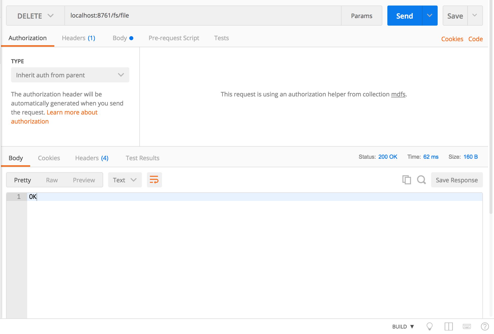
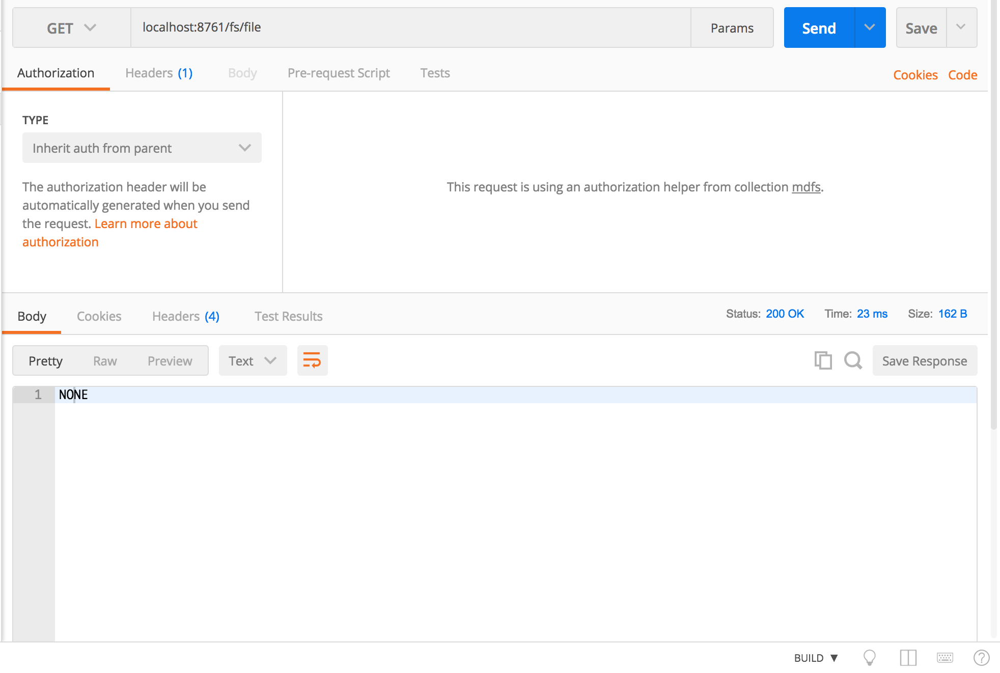
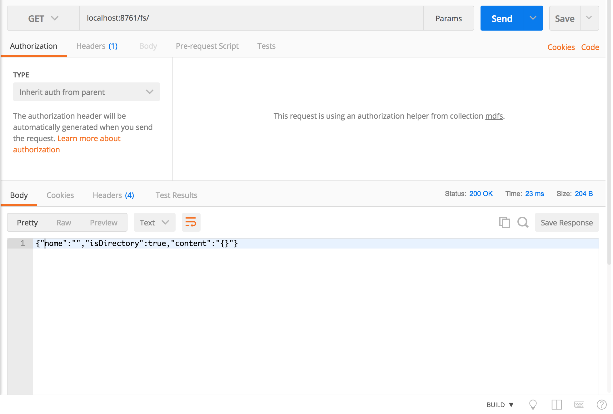

# sa-mdfs
一个基于微服务架构的分布式文件系统。

## 总体架构
整个系统有两类服务节点：NameNode节点和DataNode节点。其中NameNode为单节点，DataNode为多个节点。同时，NameNode其自身为Eureka服务器，DataNode为Eureka客户端，DataNode启动后会向Eureka服务器也就是NameNode进行注册。由于NameNode自身就是Eureka服务器，对DataNode健康状态的检测也就很自然能够实现。

两类服务节点的实现都基于Spring-boot框架，并提供RestController的交互接口。用户与NameNode进行交互，实现文件上传、查看和删除。DataNode只与NameNode进行交互，用户感受不到DataNode的存在。

文件目录信息存储在NameNode中，文件具体内容则被划分为若干块存储到不同的DataNode中，每个数据块都有若干副本存储在不同的DataNode中。用户发起查看某个文件的请求时，NameNode首先从目录信息中查到文件内容的存储地点，然后根据一定的负载均衡策略去取数据，并对其进行拼接，再返回到用户。

NameNode中存储DataNode的结点信息。使用了Listener监听Eureka服务器的事件，在DataNode结点加入或离开时，都可以进行相应的处理。当有新的DataNode注册时，将其纳入结点列表，等候数据存取。当有DataNode下线时，则检查其上有哪些数据块，并从存有这些数据块的结点上将这些数据块复制一份，转存到其余的结点上，保证数据有多份存储，保持系统可靠性。

目前的负载均衡策略为：每次对一个DataNode发起数据存取请求后，就将其Load值增加一，每次存储数据都优先选Load值较低的DataNode结点。

## 使用说明
系统由两个工程组成。NameNode直接使用`mvn spring-boot:run`启动，块大小、副本数和端口号都在application.properties文件中配置。DataNode使用`mvn spring-boot:run -Dserver.port=xxxx`启动，多个DataNode需要使用不同的端口号。

NameNode的文件系统存取接口路径为/fs,例如根路径对应URL为/fs/，使用POSTMAN进行测试如下：
1. put /fs/file

2. get /fs/file

3. get /fs/

4. delete /fs/file

5. get /fs/file

6. get /fs/

